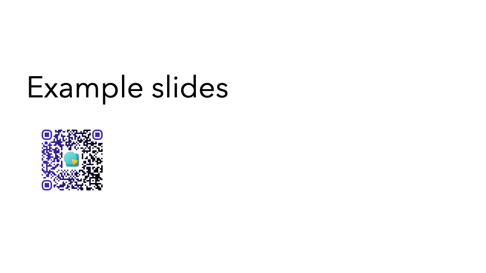

# slidev-addon-qrcode

[Slidev](https://sli.dev/) add-on qrcode component



## Dependencies

- [qrcode-vue3](https://github.com/scholtz/qrcode-vue3)

## Installation

```console
npm i @katzumi/slidev-addon-qrcode
```

## Slidev Configuration

Define this package into your slidev addons.

In your slides metadata (using Front Matter):

```yaml
addons:
  - "@katzumi/slidev-addon-qrcode"
```

Or in your `package.json`:
```json
{
  "slidev": {
    "addons": [
      "@katzumi/slidev-addon-qrcode"
    ]
  }
}
```

## Components

You can create a poll by using the [QRCode component](#QRCode).

### QRCode

```xml
<QRCode
  value="https://github.com/k2tzumi/slidev-addon-qrcode"
  width="180"
  height="180"
  color="4329B9"
  image="83095831.png"
/>
```

Parameters:
* `value` (`string`) : The date will be encoded to the QR code
* `width` (`number` , default `200`)  : Size of canvas
* `height` (`number` , default `200`)  : Size of canvas
* `color` (`string` , default `000000`)  : Color code of QR dots
* `image` (`string`)  : The image will be copied to the center of the QR code

